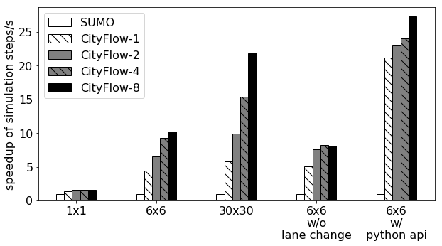

Introduction
============

.. attention::
    The project is under active development, stable version of documentation and source code will be ready by mid May, stay tuned!

CityFlow is a multi-agent reinforcement learning environment for large scale city traffic scenario. 

Checkout these features!

- a microscopic traffic simulator which simulates the behavior of each vehicle, providing highest level detail of traffic evolution.
- support flexible definitions for road network and traffic flow
- provides friendly python interface for reinforcement learning
- **Fast!** Elaborately designed data structure and simulation algorithm with multithreading. Capable of simulating city-wide traffic. See the performance comparison with SUMO [#sumo]_.

    Performance comparison between CityFlow and SUMO. From small 1x1 grid roadnet to city-level 30x30 roadnet. Even faster when you need to interact with the simulator through python API.

See :ref:`start` to get started.

.. [#sumo] `SUMO home page <https://sumo.dlr.de/index.html>`_